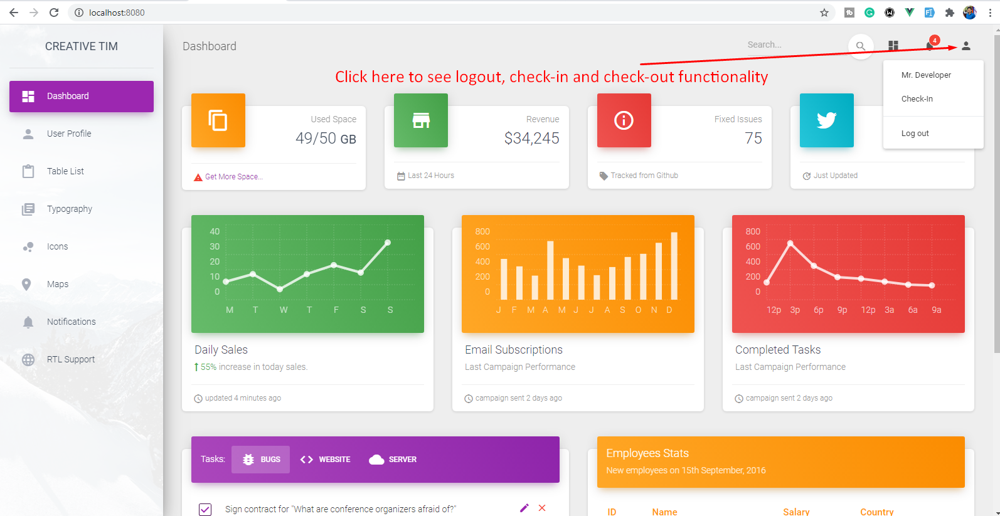

## Vue Assignment

## Project setup

npm install

npm run serve

### Project overview

After open the project with browser, please navigate to top-right corner as mention in screenshot for check simple check-in, check-out and logout functionality

* An Employee can't check-in before 07:45 am.
* An Employee can't check-in twitch in a day.
* After check-in for the day, check-in button will be invisible and check-out button will be visible.
* After check-out for the day, check-in and check-out both button will be invisible for that day.